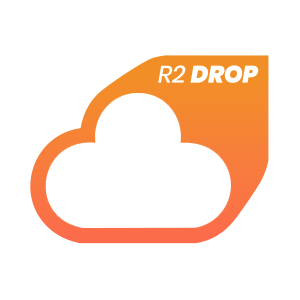

<p align="center">
  
</p>

<h1 align="center">☁️ R2Drop</h1>

<p align="center">
  <strong>A native macOS uploader for Cloudflare R2</strong><br/>
  Finder · Menu Bar · Dock · CLI
</p>

<p align="center">
  <a href="https://r2drop.com">
    
  </a>
  <a href="https://r2drop.com/install.sh">
    
  </a>
  <a href="https://github.com/superhumancorp/homebrew-tap">
    
  </a>
  <a href="https://github.com/superhumancorp/r2drop/actions/workflows/ci.yml">
    
  </a>
</p>

---

## 🚀 What is R2Drop?

R2Drop makes Cloudflare R2 uploads feel **native** on macOS. No dashboards, no context switching — just drag, drop, and get a URL.

- 📁 **Finder** right-click → *Send to R2*
- 🔽 **Drag & drop** onto menu bar or Dock icon
- 📂 **File picker** for files and folders
- 🔗 **Deep links** (`r2drop://...`) for automation
- 💻 **CLI** companion for terminal workflows

## ✨ Features

| Feature | Description |
|---------|-------------|
| 🔄 **Background queue** | Progress tracking, retries, pause/resume/cancel |
| 👥 **Multi-account** | Switch accounts from the menu bar |
| 🪣 **Bucket routing** | Per-account bucket + path prefix config |
| 🔗 **Public URLs** | Auto-copy with custom domain support |
| 🔔 **Notifications** | Success, failure, and token expiry alerts |
| 🔒 **Privacy** | Optional anonymous telemetry (can be fully disabled) |

## 📦 Install

### macOS App (Direct Download)

Download the latest `.dmg` from [GitHub Releases](https://github.com/superhumancorp/r2drop/releases).

### CLI

**Homebrew (coming soon):**
```bash
brew tap superhumancorp/tap
brew install --formula superhumancorp/tap/r2drop
```

**Quick install:**
```bash
curl -fsSL https://r2drop.com/install.sh | bash
```

**From the macOS app:** Open Settings → Install CLI (installs to `/usr/local/bin`)

## 🏁 Quick Start

1. Launch R2Drop
2. Complete onboarding — paste a Cloudflare API token, select a bucket
3. Upload via Finder right-click, drag-and-drop, or CLI
4. Copy the URL from the notification or queue UI

## 💻 CLI Usage

```bash
r2drop login              # Interactive or scripted auth
r2drop upload <path>      # Upload files or folders
r2drop status             # Check upload status
r2drop queue              # View upload queue
r2drop accounts           # Manage accounts
r2drop history            # Browse upload history
r2drop config get/set     # Configuration
```

JSON output supported for automation: `r2drop upload file.png --json`

Full CLI reference: [`CLI.md`](../app/CLI.md)

## 🏗️ Project Structure

```
├── src/
│   ├── app/                # macOS app (Swift/SwiftUI)
│   │   ├── R2Drop/        # Main app target
│   │   ├── FinderExtension/  # Finder Sync extension
│   │   └── Packages/      # Local Swift packages (R2Core, R2Bridge)
│   ├── app/engine/r2-cli/ # CLI companion (Rust crate + binary target)
│   └── www/               # Marketing website (r2drop.com)
├── src/homebrew/          # Homebrew tap templates
├── scripts/           # Install scripts
├── src/releases/          # Release notes per version
└── .github/workflows/     # CI/CD (build, release, deploy)
```

## 🔧 Development

```bash
# Clone
git clone https://github.com/superhumancorp/r2drop.git
cd r2drop

# Build the macOS app
cd app
xcodebuild build -scheme R2Drop -destination 'platform=macOS'

# Build the CLI
cd app/engine/r2-cli
cargo build --release
```

## 📊 Analytics

R2Drop uses PostHog for anonymous telemetry with full user control:
- Toggle in onboarding and Settings
- Sensitive values sanitized/hashed
- Error tracking is rate-limited and deduplicated

See [`TELEMETRY.md`](../app/TELEMETRY.md) for the event catalog.

## 🛠️ CI/CD

| Workflow | Trigger | What it does |
|----------|---------|--------------|
| `ci.yml` | Push/PR to `main` | Build + lint |
| `release.yml` | Tag `v*` | Sign, notarize, publish DMGs, bump Homebrew tap |
| `cli-release.yml` | Tag `cli-v*` | Build CLI (macOS arm64 + x86_64) |
| `deploy-www.yml` | Push to `www/` | Deploy website to Cloudflare R2 |

## 🐛 Troubleshooting

<details>
<summary><strong>Finder right-click item missing</strong></summary>

Finder Sync extensions are cached aggressively:

1. System Settings → Privacy & Security → Extensions → Finder Extensions
2. Toggle R2Drop extension off/on
3. `killall Finder`
</details>

<details>
<summary><strong><code>r2drop</code> command not found</strong></summary>

Add `~/.local/bin` to your PATH:

```bash
echo 'export PATH="$HOME/.local/bin:$PATH"' >> ~/.zshrc && source ~/.zshrc
```
</details>

## 📄 License

Copyright © 2026 Superhuman Intelligence LLC. All rights reserved.

---

<p align="center">
  Built with ❤️ by <a href="https://superhumancorp.com">Superhuman Intelligence LLC</a>
</p>
